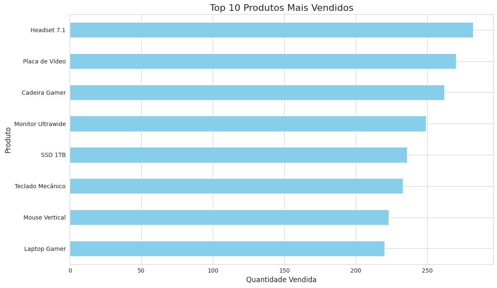
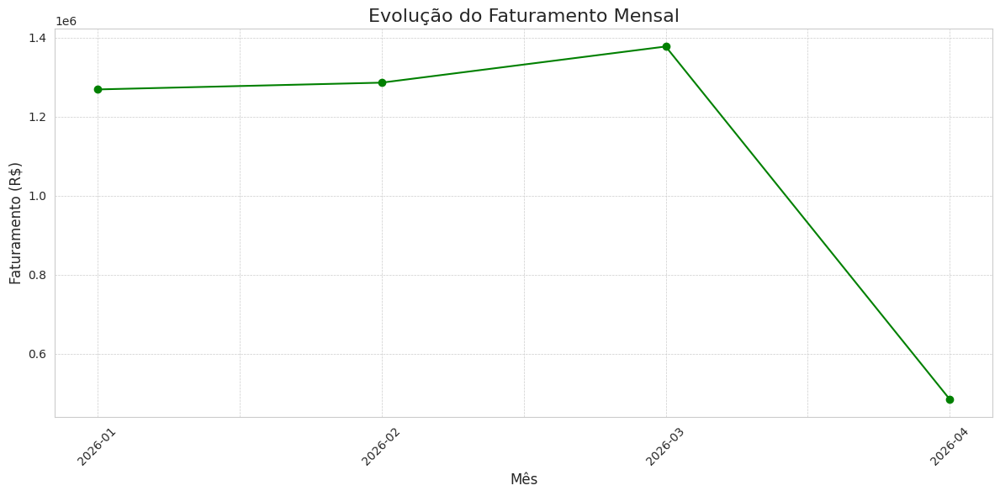
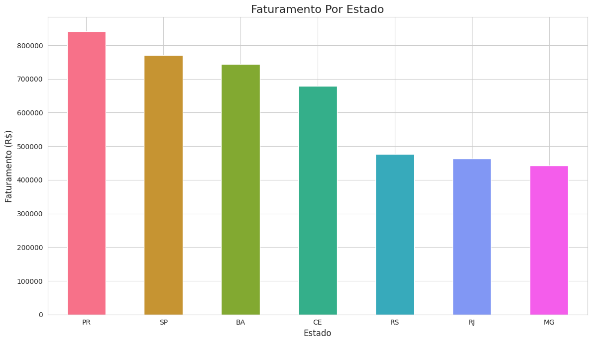
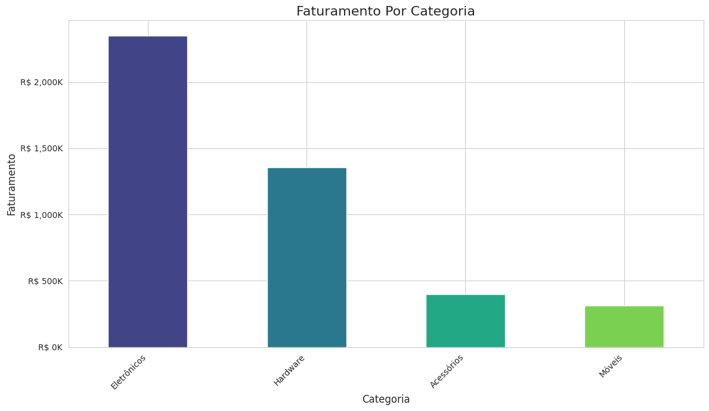

# Análise de Vendas de E-commerce com Python

Análise exploratória de dados de vendas de uma loja de e-commerce, usando
NumPy, Pandas e Matplotlib. O projeto vai da definição do problema de negócio
até a entrega de insights, passando por limpeza, engenharia de atributos e
quatro análises com visualizações.

> **Crédito:** projeto desenvolvido como **Mini-Projeto 1** do curso gratuito
> *Fundamentos de Linguagem Python - Do Básico a Aplicações de IA* da
> [Data Science Academy (DSA)](https://www.datascienceacademy.com.br).
> Implementei o projeto como parte dos meus estudos.

## 🎯 O projeto

- **Desafio:** transformar dados brutos de vendas em informação útil para
  decisões de negócio.
- **O que faço:** gero uma base fictícia de vendas, faço limpeza e engenharia
  de atributos (faturamento, status de entrega, mês) e respondo a quatro
  perguntas de negócio com tabelas e gráficos.
- **Resultado:** um panorama claro de produtos, faturamento, regiões e
  categorias que mais pesam no resultado da loja.

## 📊 Análises e visualizações

**1. Top 10 produtos mais vendidos**

**2. Faturamento mensal**

**3. Vendas por estado**

**4. Faturamento por categoria**

## 🛠️ Ferramentas

Python · NumPy · Pandas · Matplotlib · Seaborn

## ▶️ Como rodar

1. Clone o repositório e abra o notebook `analise_vendas_ecommerce.ipynb`
   (Jupyter, VS Code ou Google Colab).
2. Instale as dependências: `pip install numpy pandas matplotlib seaborn`
3. Execute as células na ordem.

O GitHub já mostra o notebook com os gráficos direto no navegador.

## 📚 Referência

Mini-Projeto do curso *Fundamentos de Linguagem Python* da
[Data Science Academy](https://www.datascienceacademy.com.br).
